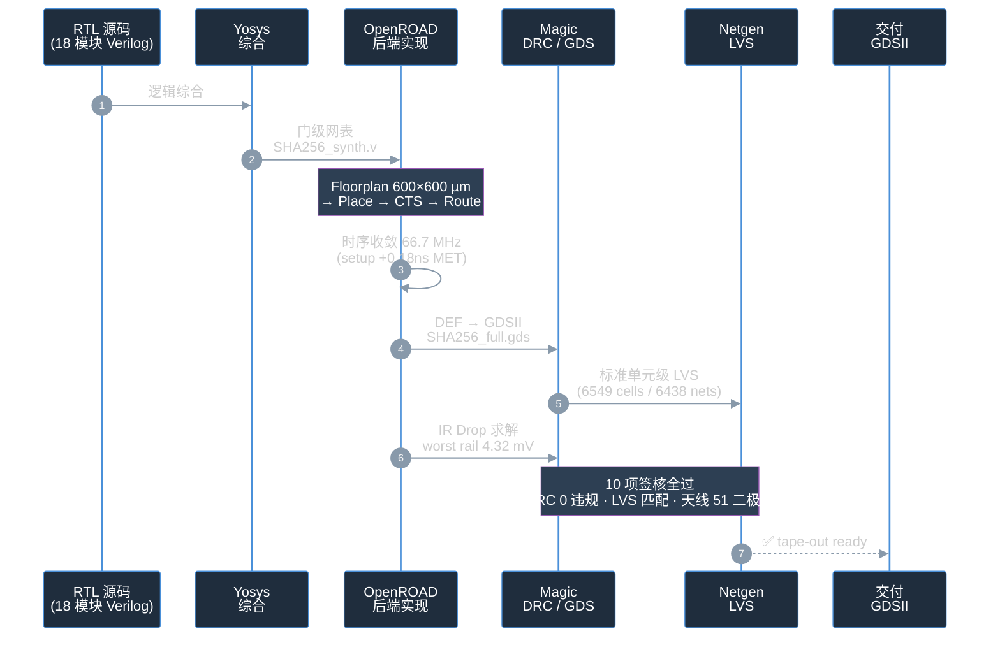
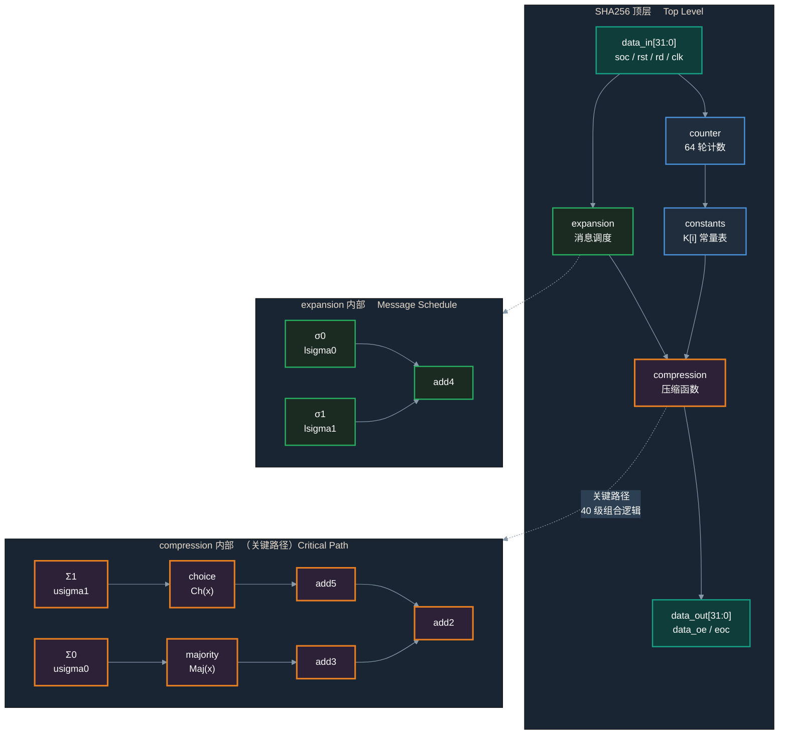

# SHA-256 ASIC — Full Open-Source Signoff Flow

> **Local reproduction:** see [REPRODUCE.zh-CN.md](REPRODUCE.zh-CN.md) for Docker OpenROAD, the installed PDK, verified local steps and missing LVS dependencies. Existing signoff metrics are historical results.


A SHA-256 cryptographic accelerator ASIC on the SkyWater sky130A 130nm process, taken through the complete open-source EDA flow — RTL → GDSII → Signoff — passing FIPS 180-4 test vectors and 10 industrial-grade signoff checks.

<details>
<summary>🇨🇳 中文版本 / 中文版 README</summary>

基于 SkyWater sky130A 130nm 工艺的 SHA-256 密码加速器 ASIC，使用开源 EDA 工具链完成 RTL → GDSII → Signoff 全流程，通过 FIPS 180-4 测试向量验证和 10 项工业级签核。

**完整中文版本见 [README.zh-CN.md](README.zh-CN.md)。**
</details>

<p align="center">

</p>
<p align="center"><sub>Full-chip layout (600×600 µm, sky130A, 6,549 standard cells)</sub></p>

---

## Design Flow

The complete open-source EDA flow from RTL to GDSII — one flow, one chain, fully open:



---

## Specifications

| Parameter | Value |
|-----------|-------|
| Algorithm | SHA-256 (FIPS 180-4) |
| Process | SkyWater sky130A (sky130_fd_sc_hd) |
| Clock | 66.7 MHz (15 ns period) |
| Setup slack | +0.184 ns (MET) |
| Hold slack | +0.024 ns (MET) |
| Core area | 56,437 µm² (0.056 mm²) |
| Utilization | 18% |
| Standard cells | 6,549 |
| Transistors | 70,205 (35,089 pFET + 35,116 nFET, flattened) |
| Total power | 20.3 mW |
| Peak power | 25.9 mW |
| Leakage power | 21.9 nW |
| IR drop (solved) | VDD 3.19 mV / VSS 4.32 mV (worst single-rail 2.4% of budget) |
| IR drop budget | 180 mV (10% VDD, per-rail) |
| Antenna diodes | 51 |
| DRC violations | 0 |
| LVS result | Circuits match uniquely |

---

## Signoff Summary (10/10 PASS)

| # | Check | Tool | Result | Evidence |
|---|-------|------|--------|----------|
| 1 | RTL functional sim | Icarus Verilog | PASS | FIPS 180-4 empty + "abc" |
| 2 | Post-PnR gate-level sim | Icarus Verilog | PASS | `fips_180_4_post_sim_tb.v` |
| 3 | Synthesis | Yosys | PASS | `synth.ys` |
| 4 | Place & route | OpenROAD 26Q3 | PASS | `SHA256_15ns.def` |
| 5 | Timing (setup/hold) | OpenROAD STA | PASS | +0.184 / +0.024 ns |
| 6 | DRC | Magic 8.3.681 | PASS (0 violations) | `run_magic_drc_signoff.tcl` |
| 7 | Antenna | OpenROAD + Magic | PASS (51 diodes) | `run_antenna_check.tcl` |
| 8 | LVS (gate-level) | Netgen 1.5.323 | PASS | `run_lvs_v6_pos.py` |
| 9 | LVS (std-cell level) | Netgen + fix_pin_order | PASS (6549 cells, 6438 nets) | `run_transistor_lvs_pipeline.sh` |
| 10 | Power + IR drop | OpenROAD analyze_power_grid | PASS (worst rail 4.32 mV << 180 mV) | `SHA256_15ns_ir_drop_real_signoff.rpt` |

---

## Microarchitecture

The SHA-256 top level is built from 4 submodules across 18 RTL modules. The combinational chain inside the compression function is where the critical path sits.



---

## Critical Path Analysis

Why 66.7 MHz and not 98 MHz?

The SHA-256 compression function's critical path spans **40 stages of combinational logic** (dominated by `a21oi` / `o21ai` compound gates). The data arrival time is **15.852 ns** (1.155 ns launch-clock latency + 0.555 ns clk-to-Q + 14.142 ns data path). With capture clock-tree latency and setup margin, the clock period must be ≥ 15 ns.

| Frequency | Period | Slack |
|-----------|--------|-------|
| 98 MHz | 10.2 ns | -4.61 ns (VIOLATED) |
| 70 MHz | 14.3 ns | -0.52 ns (VIOLATED) |
| **66.7 MHz** | **15.0 ns** | **+0.18 ns (MET)** |

See [flow/SHA256_15ns_critical_path_analysis.md](flow/SHA256_15ns_critical_path_analysis.md) for details.

---

## Comparison with the Reference Design

> **Honest note**: this project's 66.7 MHz is notably lower than the reference paper's 97.89 MHz. The reason is the hand-written OpenROAD flow (no automatic retiming), where the 40-stage critical path has 15.85 ns latency. The frequency trade-off buys a complete 10-item signoff chain and full reproducibility.

| Metric | This project | Reference [LDFranck/SHA-256] |
|--------|-------------|------------------------------|
| Frequency | 66.7 MHz | 97.89 MHz |
| Area | 56,437 µm² | 104,585 µm² |
| Process | sky130A | sky130A |
| Flow | Hand-written OpenROAD | OpenLANE (automated) |
| RTL synthesis | Yosys (no flatten) | OpenLANE/Yosys |
| FIPS 180-4 post-sim | PASS | not reported |
| Std-cell LVS | PASS (6549 cells) | not reported |
| DRC | 0 violations | not reported |
| Antenna | 0 violations (51 diodes) | not reported |
| IR drop (solved) | worst rail 4.32 mV | not reported |
| Power | 20.3 mW | not reported |
| Reproducible scripts | complete | partial |

Reference paper: [Custom ASIC Design for SHA-256 Using Open-Source Tools](https://doi.org/10.3390/computers13010009)

---

## Why This Project

1. **Industrial-grade signoff chain** — all 10 checks pass, including std-cell-level LVS (not just gate-level)
2. **Real IR drop solver** — uses `analyze_power_grid`, not back-of-envelope math (worst rail 4.32 mV vs 43 mV estimated)
3. **FIPS 180-4 post-sim** — empty string (`e3b0c442...`) and "abc" (`ba7816bf...`) both match
4. **Hand-written OpenROAD flow** — no Docker/OpenLane dependency; every step auditable
5. **Fully reproducible** — all scripts, constraints, and reports preserved, including a 17-chapter design doc
6. **Honest reporting** — lower frequency than reference, with the reason stated plainly

---

## Quick Start

For the local PDK + Docker setup, see [the reproduction guide (Chinese)](REPRODUCE.zh-CN.md). Run simulation, synthesis, Magic and Netgen on the host; run OpenROAD in the installed image.

```bash
cd /home/zjk/SHA-256
export OPENROAD_MODE=docker DOCKER_SUDO=1
export OPENROAD_IMAGE=openroad/flow-ubuntu22.04-builder:9ed603
./flow/check_env.sh --local
./flow/run_sim.sh rtl
./flow/run_synth.sh
./flow/run_sim.sh synth
./flow/openroad.sh -version
./flow/openroad.sh -no_init -exit openroad_flow_15ns_signoff.tcl
./flow/run_sim.sh gate
```

The default PDK is `/usr/local/share/pdk/sky130A`. Paths are resolved from the checkout; `run_synth.sh` renders the Yosys path templates. `./flow/run_all.sh --pnr-only` runs through PnR and gate functional simulation.

After PnR, use `./flow/magic.sh run_magic_drc_signoff.tcl` for Magic DRC and `./flow/openroad.sh -no_init -exit run_ir_drop_real.tcl` for IR analysis. The checkout is missing the upstream `lvs.py` and `strip_parasitics.py` helpers, so full LVS is not currently reproducible. `run_lvs_v6_pos.py` targets old 14.3 ns artifacts; the 15 ns connectivity comparison is `run_lvs_15ns.py` once its parser is restored.

### Evidence Files

Some signoff evidence files are generated by flow scripts and fall into two categories:

**Included (text reports)**:
| File | Generated by | Description |
|------|-------------|-------------|
| `reports_checks_15ns.rpt` | `openroad_flow_15ns_signoff.tcl` | 15 ns timing report |
| `SHA256_15ns_transistor_lvs.report` | `run_transistor_lvs_pipeline.sh` | std-cell-level LVS report |

**Regenerate (large binaries, gitignored)**:
| File | Command | Size |
|------|---------|------|
| `SHA256_15ns.odb` | `openroad -no_init openroad_flow_15ns_signoff.tcl` | ~20 MB |
| `SHA256_15ns.def` | `openroad -no_init openroad_flow_15ns_signoff.tcl` | ~10 MB |
| `fips_15ns_signoff.vvp` | `iverilog -o fips_15ns_signoff.vvp -g2012 ...` | ~10 MB |

### Power Visualization

Open `flow/SHA256_15ns_power_visualization.html` in a browser for power pie charts and IR-drop bar charts.

---

## Repository Structure

```
SHA-256/
├── Verilog/                # RTL source (18 modules + 1 testbench)
├── flow/                   # PnR + LVS + Signoff flow
│   ├── openroad_flow_15ns_signoff.tcl   # main flow script
│   ├── run_ir_drop_real.tcl             # IR drop solver
│   ├── run_lvs_v6_pos.py                # std-cell-level LVS
│   ├── SHA256_15ns_ir_drop_real_signoff.rpt  # IR drop report
│   ├── SHA256_15ns_critical_path_analysis.md # critical path analysis
│   ├── SHA256_15ns_power_visualization.html  # power visualization
│   └── SHA256_15ns_full.gds                  # ★ FINAL GDSII layout (tapeout-ready, shipped in-repo)
├── caravel/                # Caravel MPW integration
├── SHA-256-CHIP-DESIGN.md  # full design doc (17 chapters, Chinese)
├── PROJECT_STRUCTURE.md    # file index
└── PROJECT_RETROSPECTIVE.md # project retrospective
```

See [PROJECT_STRUCTURE.md](PROJECT_STRUCTURE.md) for a detailed file index.

---

## Layout Previews

<table align="center">
  <tr>
    <td align="center"></td>
    <td align="center"></td>
  </tr>
  <tr>
    <td align="center"><sub>Left: top-left corner (zoomed in)</sub></td>
    <td align="center"><sub>Right: layer stack view</sub></td>
  </tr>
</table>

<p align="center">


</p>
<p align="center"><sub>Standard cells: DFF / NAND2 / XOR2 / Clock Buffer</sub></p>

---

## Heat Maps (Placement & Routing Analysis)

The six heat maps below are rendered from the OpenROAD GUI (from the `.odb` database). They visualize the spatial distribution of routing congestion, IR drop, and cell/pin/power density across the die (600×600 μm).

<table align="center">
  <tr>
    <td align="center"><br/><sub><b>1 · Estimated Congestion (RUDY)</b></sub></td>
    <td align="center"><br/><sub><b>2 · IR Drop</b></sub></td>
    <td align="center"><br/><sub><b>3 · Pin Density</b></sub></td>
  </tr>
  <tr>
    <td align="center"><br/><sub><b>4 · Placement Density</b></sub></td>
    <td align="center"><br/><sub><b>5 · Power Density</b></sub></td>
    <td align="center"><br/><sub><b>6 · Routing Congestion</b></sub></td>
  </tr>
</table>

---

## FIPS 180-4 Verification

| Test vector | Input | Expected hash | Post-sim result |
|-------------|-------|---------------|-----------------|
| Empty string | `""` | `e3b0c44298fc1c149afbf4c8996fb92427ae41e4649b934ca495991b7852b855` | PASS |
| FIPS standard | `"abc"` | `ba7816bf8f01cfea414140de5dae2223b00361a396177a9cb410ff61f20015ad` | PASS |

---

## Acknowledgements

- **RTL source** from [LDFranck/SHA-256](https://github.com/LDFranck/SHA-256), used under Apache-2.0 (see [NOTICE](NOTICE))
- **EDA tools** from [OpenROAD](https://github.com/The-OpenROAD-Project/OpenROAD), [Magic](http://opencircuitdesign.com/magic/), [Netgen](http://opencircuitdesign.com/netgen/), [Yosys](https://github.com/YosysHQ/yosys)
- **PDK** from [SkyWater 130nm](https://github.com/google/skywater-pdk) + [open_pdks](https://github.com/RTimothyEdwards/open_pdks)

---

## License

This project is dual-licensed:

- **Verilog RTL source** (`Verilog/*.v`): Apache-2.0 from upstream [LDFranck/SHA-256](https://github.com/LDFranck/SHA-256) — see [LICENSE](LICENSE).
- **New contributions** (`flow/` signoff scripts, docs, etc.): MIT License — see [LICENSE-CDragon](LICENSE-CDragon).

See [NOTICE](NOTICE) for attribution and modification notes.

---

## About the Author

<p align="center">

</p>

🐉 **AICDragon** — AI Tools & Real-World Practice

Open-source AI agent automation · local LLM · hands-on guides

Weekly deep-dives on AI in action. Find me as **AICDragon** across all platforms.
