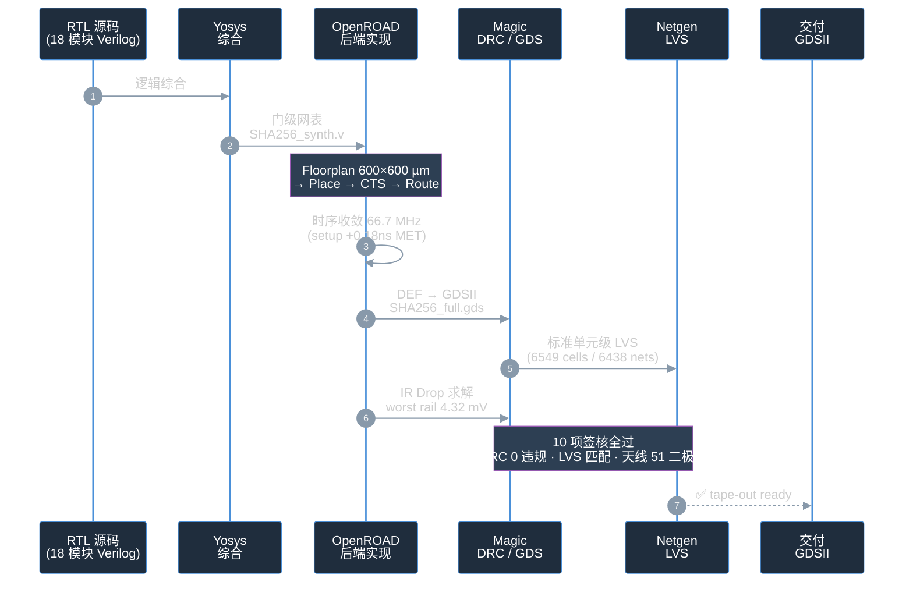
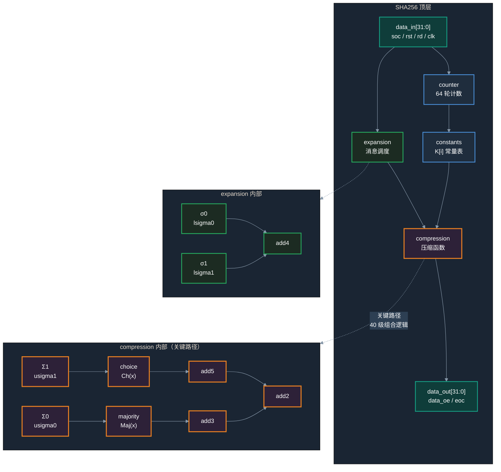

# SHA-256 ASIC — 开源全流程设计与签核

> **本机复现入口**：[REPRODUCE.zh-CN.md](REPRODUCE.zh-CN.md)。下文的作者环境、指标和签核记录为历史资料；请以该复现说明及本机新运行结果为准。


基于 SkyWater sky130A 130nm 工艺的 SHA-256 密码加速器 ASIC，使用开源 EDA 工具链完成 RTL → GDSII → Signoff 全流程，通过 FIPS 180-4 测试向量验证和 10 项工业级签核。

> 本页为中文简介版。英文完整版见 [README.md](README.md)。

<p align="center">

</p>
<p align="center"><sub>SHA-256 版图全貌（600×600 µm，sky130A，6,549 标准单元）</sub></p>

---

## 设计流程

从 RTL 到 GDSII 的完整开源 EDA 流程（一套流程、一条链、全开源）：



---

## 规格表

| 参数 | 数值 |
|------|------|
| 算法 | SHA-256 (FIPS 180-4) |
| 工艺 | SkyWater sky130A (sky130_fd_sc_hd) |
| 时钟频率 | 66.7 MHz (15 ns 周期) |
| Setup slack | +0.184 ns (MET) |
| Hold slack | +0.024 ns (MET) |
| 核心面积 | 56,437 µm² (0.056 mm²) |
| 利用率 | 18% |
| 标准单元数 | 6,549 |
| 晶体管数 | 70,205（35,089 pFET + 35,116 nFET，Netgen 展平）|
| 总功耗 | 20.3 mW |
| 峰值功耗 | 25.9 mW |
| 泄漏功耗 | 21.9 nW |
| IR drop (真实求解) | VDD 3.19 mV / VSS 4.32 mV (worst single-rail 2.4% of budget) |
| IR drop budget | 180 mV (10% VDD, per-rail) |
| 天线修复二极管 | 51 |
| DRC 违规 | 0 |
| LVS 结果 | Circuits match uniquely |

---

## Signoff 签核表（10 项全过）

| # | 签核项 | 工具 | 结果 | 证据文件 |
|---|--------|------|------|---------|
| 1 | RTL 功能仿真 | Icarus Verilog | PASS | FIPS 180-4 空串 + "abc" |
| 2 | 门级后仿 (Post-PnR) | Icarus Verilog | PASS | `fips_180_4_post_sim_tb.v` |
| 3 | 综合 | Yosys | PASS | `synth.ys` |
| 4 | 布局布线 | OpenROAD 26Q3 | PASS | `SHA256_15ns.def` |
| 5 | 时序 (setup/hold) | OpenROAD STA | PASS | +0.184 / +0.024 ns |
| 6 | DRC 物理规则 | Magic 8.3.681 | PASS (0 违规) | `run_magic_drc_signoff.tcl` |
| 7 | 天线效应 | OpenROAD + Magic | PASS (51 二极管) | `run_antenna_check.tcl` |
| 8 | LVS (门级) | Netgen 1.5.323 | PASS | `run_lvs_v6_pos.py` |
| 9 | LVS (标准单元级) | Netgen + fix_pin_order | PASS (6549 单元, 6438 net) | `run_transistor_lvs_pipeline.sh` |
| 10 | 功耗 + IR drop | OpenROAD analyze_power_grid | PASS (worst rail 4.32 mV << 180 mV) | `SHA256_15ns_ir_drop_real_signoff.rpt` |

---

## 微架构

SHA-256 顶层由 4 个子模块 + 18 个 RTL 模块构成。压缩函数（compression）内的组合链是时序关键路径所在。



---

## 关键路径分析

为什么是 66.7 MHz 而不是 98 MHz？

SHA-256 压缩函数的关键路径穿过 **40 级组合逻辑**（以 `a21oi`/`o21ai` 复合门为主），数据到达时间 **15.852 ns**（含 1.155 ns 时钟延迟 + 0.555 ns clk-to-Q + 14.142 ns 数据路径）。加上 capture 时钟树延迟和 setup margin，时钟周期必须 ≥ 15 ns。

| 频率 | 周期 | Slack |
|------|------|-------|
| 98 MHz | 10.2 ns | -4.61 ns (VIOLATED) |
| 70 MHz | 14.3 ns | -0.52 ns (VIOLATED) |
| **66.7 MHz** | **15.0 ns** | **+0.18 ns (MET)** |

详细分析见 [flow/SHA256_15ns_critical_path_analysis.md](flow/SHA256_15ns_critical_path_analysis.md)。

---

## 与参考设计对比

> **诚实标注**：本项目的 66.7 MHz 明显低于参考论文的 97.89 MHz。原因是本项目使用手工 OpenROAD 流程（无自动 retiming），关键路径 40 级组合逻辑延迟 15.85 ns。频率的代价换来的是完整的 10 项签核链和可复现性。

| 指标 | 本项目 | 参考 [LDFranck/SHA-256] |
|------|--------|----------------------|
| 频率 | 66.7 MHz | 97.89 MHz |
| 面积 | 56,437 µm² | 104,585 µm² |
| 工艺 | sky130A | sky130A |
| 流程 | 手工 OpenROAD | OpenLANE (自动) |
| RTL 综合 | Yosys (无 flatten) | OpenLANE/Yosys |
| FIPS 180-4 后仿 | PASS | 未报告 |
| 标准单元级 LVS | PASS (6549 单元) | 未报告 |
| DRC | 0 违规 | 未报告 |
| 天线效应 | 0 违规 (51 二极管) | 未报告 |
| IR drop (真实) | worst rail 4.32 mV | 未报告 |
| 功耗 | 20.3 mW | 未报告 |
| 可复现脚本 | 完整 | 部分 |

参考论文：[Custom ASIC Design for SHA-256 Using Open-Source Tools](https://doi.org/10.3390/computers13010009)

---

## 卖点

1. **工业级 signoff 链** — 10 项签核全部通过，包括标准单元级 LVS（不只是门级）
2. **真实 IR drop 求解** — 使用 `analyze_power_grid` 求解，非手算估算（worst rail 4.32 mV vs 估算 43 mV）
3. **FIPS 180-4 后仿验证** — 空串 (`e3b0c442...`) 和 "abc" (`ba7816bf...`) 均匹配
4. **手工 OpenROAD 流程** — 不依赖 Docker/OpenLane，每一步可审查
5. **完整可复现** — 所有脚本、约束、报告均保留，含 17 章设计文档
6. **诚实标注** — 频率低于参考但坦承原因，反而更可信

---

## 快速开始

当前环境的完整步骤见 [本机复现说明](REPRODUCE.zh-CN.md)。推荐本地运行 Yosys/Icarus/Magic/Netgen，OpenROAD 使用已有 Docker 镜像。

```bash
cd /home/zjk/SHA-256
export OPENROAD_MODE=docker DOCKER_SUDO=1
export OPENROAD_IMAGE=openroad/flow-ubuntu22.04-builder:9ed603
./flow/check_env.sh --local
./flow/run_sim.sh rtl
./flow/run_synth.sh
./flow/run_sim.sh synth
./flow/openroad.sh -version
./flow/openroad.sh -no_init -exit openroad_flow_15ns_signoff.tcl
./flow/run_sim.sh gate
```

本地 PDK 默认是 `/usr/local/share/pdk/sky130A`。Tcl 路径自动定位；综合使用 `run_synth.sh` 渲染路径模板。也可用 `./flow/run_all.sh --pnr-only` 执行到布局布线后功能仿真。

PnR 完成后，可执行 `./flow/magic.sh run_magic_drc_signoff.tcl` 和 `./flow/openroad.sh -no_init -exit run_ir_drop_real.tcl` 等检查。

**当前限制**：完整 LVS 缺少仓库未提交的 `lvs.py`、`strip_parasitics.py`；旧 `run_lvs_v6_pos.py` 对应 14.3 ns 产物。历史报告不等同于本机签核通过，详见复现说明。仓库自带的 `flow/SHA256_15ns_full.gds` 是作者历史版图，可直接用 KLayout 查看。

---

## 热力图（布局与布线分析）

以下六张热力图由 OpenROAD GUI 从 `.odb` 数据库导出，可视化芯片（600×600 μm）上布线拥塞、IR 压降、以及单元/引脚/功耗密度的空间分布。

<table align="center">
  <tr>
    <td align="center"><br/><sub><b>1 · Estimated Congestion (RUDY)</b></sub></td>
    <td align="center"><br/><sub><b>2 · IR Drop</b></sub></td>
    <td align="center"><br/><sub><b>3 · Pin Density</b></sub></td>
  </tr>
  <tr>
    <td align="center"><br/><sub><b>4 · Placement Density</b></sub></td>
    <td align="center"><br/><sub><b>5 · Power Density</b></sub></td>
    <td align="center"><br/><sub><b>6 · Routing Congestion</b></sub></td>
  </tr>
</table>

---

## 致谢

- **RTL 源码** 来自 [LDFranck/SHA-256](https://github.com/LDFranck/SHA-256)，按 Apache-2.0 许可证使用（详见 [NOTICE](NOTICE)）
- **EDA 工具** 来自 [OpenROAD](https://github.com/The-OpenROAD-Project/OpenROAD)、[Magic](http://opencircuitdesign.com/magic/)、[Netgen](http://opencircuitdesign.com/netgen/)、[Yosys](https://github.com/YosysHQ/yosys)
- **PDK** 来自 [SkyWater 130nm](https://github.com/google/skywater-pdk) + [open_pdks](https://github.com/RTimothyEdwards/open_pdks)

---

## License

本项目采用双许可证：

- **Verilog RTL 源码**（`Verilog/*.v`）：遵循上游 [LDFranck/SHA-256](https://github.com/LDFranck/SHA-256) 的 Apache-2.0 许可证 — 见 [LICENSE](LICENSE)。
- **本项目新增部分**（`flow/` 签核脚本、文档等）：MIT License — 见 [LICENSE-CDragon](LICENSE-CDragon)。

归因与修改说明见 [NOTICE](NOTICE)。

---

## 关于作者

<p align="center">

</p>

🐉 **AICDragon** — AI 工具与实战

开源 AI 智能体自动化 · 本地大模型 · 实操指南

每周深挖 AI 实战，全网同名 **AICDragon**。
