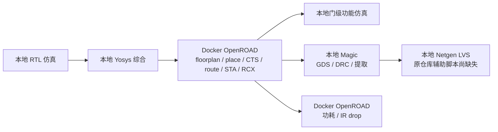

# 本机复现：本地工具 + Docker OpenROAD

本项目可以采用混合方式运行：本机做仿真、综合、Magic 版图处理和 Netgen 比对，只有 OpenROAD 在 Docker 中执行。无需为了复现独立 SHA256 核心而安装 OpenLane 或 Caravel。

本次适配针对 `/home/zjk/SHA-256`、`/usr/local/share/pdk/sky130A` 和你提供的镜像 `openroad/flow-ubuntu22.04-builder:9ed603`。脚本自动定位项目目录，移动仓库后也不需要替换作者用户名。

## 1. 项目实际实现

- `Verilog/SHA256.v` 是独立核心，接口是 `data_in[31:0]`、`data_out[31:0]`、`data_oe`、`clk/rst/soc/rd/eoc`，不是 Wishbone 总线。
- `counter` 控制 64 轮运算，`constants` 给出 K 常量，`expansion` 生成消息调度字，`compression` 更新 A～H。`add2`～`add5` 是不同输入数量的 32 位加法器，输出截断到 32 位。
- 外部需预先完成消息填充，按 16 个 32 位字送入一个 512 位消息块；完成后读取 8 个哈希字。
- 当前 `wvar.v` 每次 `soc` 都重载固定 IV，没有跨消息块保存链式哈希状态。因此当前通过的是空串和 `abc` 两个单块用例，不能据此声称支持任意长度消息。
- 主后端入口是 `flow/openroad_flow_15ns_signoff.tcl`，目标周期 15 ns，die 为 600×600 µm，core 为 20～580 µm。README 中的 slack、面积、功耗属于作者历史结果，需要在当前工具/PDK 组合下重新测量。
- `caravel/` 是另一条集成路线，额外需要匹配的 OpenLane/Caravel 环境和接口验证，不是运行上述核心流程的前提。



## 2. 已检查的本机环境

2026-09-18 的检查结果：

| 工具/资源 | 当前环境 | 本次实际验证 |
|---|---|---|
| Yosys | OSS CAD Suite，0.69+62 | 使用本机 TT Liberty 完成综合 |
| Icarus Verilog / vvp | OSS CAD Suite，14.0 devel | RTL 与综合后网表的空串、`abc` 均通过 |
| Magic | `/usr/local/bin/magic`，8.3.683 | 成功加载本机 sky130A 技术文件；尚未对新布局跑 DRC |
| Netgen | `/usr/local/bin/netgen`，1.5.323 | 能启动；完整 LVS 尚未执行 |
| KLayout | `/usr/bin/klayout`，0.30.12 | 已读取仓库 GDS，顶层为 `SHA256`，共 71 个 cell |
| GCC / Python / Bash / Tcl | 本机工具 | C 参考程序编译运行，`abc` 哈希正确 |
| PDK | `/usr/local/share/pdk/sky130A` | LEF、Liberty、GDS、CDL、SPICE、仿真模型及 Magic/Netgen 配置齐全 |
| OpenROAD | 你提供的 Docker 镜像 | 当前会话无法访问 Docker socket，sudo 需交互密码；尚未启动容器验证 |

PDK 的 `.config/nodeinfo.json` 记录 open_pdks 构建版本 `1.0.608`、提交 `1689ac3f2dc763876eaf967227c7dfe831b031ae`。本机无独立 `sta` 命令不影响核心流程，STA 在 OpenROAD 内运行。

## 3. 路径配置如何工作

`flow/env.sh`、`flow/paths.tcl` 和 `flow/paths.py` 为 Shell、Tcl、Python 提供一致的路径规则：

| 设置 | 默认值/作用 |
|---|---|
| 项目目录 | 根据脚本自身位置推导，不依赖调用时的工作目录 |
| `PDK_ROOT` | `/usr/local/share/pdk`，包含多个工艺的父目录 |
| `PDK` | `sky130A` |
| `PDK_PATH` | 完整工艺目录；若显式设置，优先于上面两个变量 |
| `OPENROAD_MODE` | `auto`；本地无 `openroad` 时使用 Docker。可显式设为 `docker` 或 `local` |
| `OPENROAD_IMAGE` | `openroad/flow-ubuntu22.04-builder:9ed603` |
| `DOCKER_SUDO` | 默认 `0`；你的环境需设为 `1`，仅为 Docker 命令使用 sudo |
| `OPENROAD_THREADS` | `8` |
| `OPENROAD_CONTAINER_BIN` | `openroad`；镜像布局不同时可改成容器内可执行文件的绝对路径 |
| `OPENROAD_BIN` | 本地模式的可执行文件，默认 `openroad` |
| `YOSYS/MAGIC/NETGEN/IVERILOG/VVP/PYTHON` | 本地可执行文件名或路径，不要填含参数的整条命令 |

综合与物理实现均读取同一个 `sky130_fd_sc_hd` TT 角 Liberty，以及本机对应的 LEF/GDS。原作者从 OpenROAD 测试目录读取的精简库已改为你的 open_pdks 库，映射结果和物理指标可能随之变化。

轨道、PDN、估算 RC 和 OpenRCX 提取规则并不等同于 PDK 的标准单元库；现已放入 `flow/platform/sky130hd/`，附来源提交及许可证，不再依赖作者的 OpenROAD 源码目录，也不需要把你的整个 OpenROAD 源码挂入容器。这些参考 RC 规则仍需结合实际 PDK/工具验证。

## 4. 建议执行顺序

在你自己的终端运行以下命令。整个流程保持普通用户身份，Docker 入口内部单独调用 sudo。

```bash
cd /home/zjk/SHA-256
export OPENROAD_MODE=docker
export DOCKER_SUDO=1
# 默认已是此镜像，显式写出便于记录实验环境
export OPENROAD_IMAGE=openroad/flow-ubuntu22.04-builder:9ed603

# 本地依赖和 PDK 检查；LVS 缺文件会单独列出
./flow/check_env.sh --local

# 在你的终端输入 sudo 密码，然后验证容器内 OpenROAD
sudo -v
./flow/openroad.sh -version

# 本地步骤：本次已执行通过
./flow/run_sim.sh rtl
./flow/run_synth.sh
./flow/run_sim.sh synth

# Docker 中执行布局布线及寄生提取，结果写回本机 flow/
./flow/openroad.sh -no_init -exit openroad_flow_15ns_signoff.tcl

# 新布局网表的功能仿真，需要上一步产出 final.v
./flow/run_sim.sh gate
```

`synth.ys` 和 `synth_98mhz.ys` 现在是路径模板，由 `run_synth.sh` 渲染到 `flow/.build/` 后交给 Yosys，不再直接运行 `yosys synth.ys`。98 MHz 文件保留作历史实验，不是推荐复现入口。

也可以一次运行到布局布线后功能仿真：

```bash
./flow/run_all.sh --pnr-only

# 已有综合网表时
./flow/run_all.sh --pnr-only --skip-synth
```

每步失败会停止，日志在 `flow/.build/`。`--pnr-only` 不执行物理签核。`run_15ns.sh` 是复用综合网表的兼容入口，`run_synth_flatten.sh` 转到新的本地综合入口。

主要产物：`flow/SHA256_synth.v`、`flow/SHA256_15ns_final.v`、`flow/SHA256_15ns.def`、`flow/SHA256_15ns.odb`、`flow/SHA256_15ns.spef`。仿真波形及日志分别放在 `.build/rtl/`、`.build/synth/`、`.build/gate/`。

## 5. Docker 为什么要这样运行

原来的 `sudo docker run --rm -it IMAGE bash` 没有挂载项目或 PDK，容器不能直接读取宿主机中的这些文件。`flow/openroad.sh` 增加了两项 bind mount：项目目录可写、PDK 目录只读，并使用宿主机 UID/GID 避免产出变成 root 所有。

先查看实际命令而不启动容器：

```bash
DOCKER_SUDO=1 ./flow/openroad.sh --dry-run -no_init -exit openroad_flow_15ns_signoff.tcl
```

等价的手动命令如下（适用于此 ORFS builder 镜像的标准目录布局）：

```bash
sudo docker run --rm -i \
  --user "$(id -u):$(id -g)" \
  --mount type=bind,src=/home/zjk/SHA-256,dst=/home/zjk/SHA-256 \
  --mount type=bind,src=/usr/local/share/pdk,dst=/usr/local/share/pdk,readonly \
  --workdir /home/zjk/SHA-256/flow \
  --env PDK_ROOT=/usr/local/share/pdk --env PDK=sky130A \
  --entrypoint /bin/bash \
  openroad/flow-ubuntu22.04-builder:9ed603 \
  -c 'source /OpenROAD-flow-scripts/env.sh && exec openroad -no_init -exit openroad_flow_15ns_signoff.tcl'
```

启动器会在必要时加载镜像的 `env.sh`；不会主动拉取新版本替换指定标签。`-no_init` 避免加载用户初始化文件，`-exit` 使脚本结束后退出 OpenROAD。`--rm` 删除临时容器，bind mount 中的结果仍保留。这与 [ORFS 官方 Docker 用法](https://openroad-flow-scripts.readthedocs.io/en/latest/user/BuildWithDocker.html)一致；启动参数见 [OpenROAD Run 文档](https://github.com/The-OpenROAD-Project/OpenROAD#run)。

## 6. PnR 完成后的检查

延续上面的环境变量，在项目根目录执行：

```bash
# 本地 Magic，启动器显式加载 sky130A.magicrc
./flow/magic.sh run_magic_gds.tcl
./flow/magic.sh run_magic_drc_signoff.tcl

# Docker OpenROAD
./flow/openroad.sh -no_init -exit run_area_report.tcl
./flow/openroad.sh -no_init -exit run_antenna_check.tcl
./flow/openroad.sh -no_init -exit run_power_ir_signoff.tcl
./flow/openroad.sh -no_init -exit run_ir_drop_real.tcl

# 本机查看版图
klayout flow/SHA256_15ns_full.gds -l sky130_colors.lyp
```

仓库已包含约 21 MB 的历史 `SHA256_15ns_full.gds`，可以直接查看；重新导出会覆盖这个同名文件。阅读新结果时应与历史报告区分。

功耗脚本已去掉固定打印的作者功耗数值，改为读取当前 Liberty/SDC/SPEF 计算。未加载 VCD/SAIF 活动率，结果依赖 STA 的活动率假设。IR 脚本仍使用仓库的四个电压源位置，修改 PDN/尺寸后须重新核对这些位置。

门级仿真使用本机 PDK 的 `primitives.v` 与 `sky130_fd_sc_hd.v`，避免作者精简单元模型缺少新映射出的单元。它是无 SDF 的功能仿真；10 ns 的 testbench 时钟不能证明物理设计能跑 100 MHz，时序结论要看 15 ns SDC 下的 STA。

## 7. 尚不能当作完整复现的部分

1. **Docker 执行尚未验证。** 本次自动化会话不能交互输入 sudo 密码，无法确认镜像内 OpenROAD 版本或实跑 PnR。先执行 `./flow/openroad.sh -version`，再看新运行的日志；如有 Tcl 命令不兼容，应按该镜像版本调整。
2. **LVS 辅助源码缺失。** `run_lvs_15ns.py` 依赖未提交的 `flow/lvs.py`；历史提取流水线还依赖缺失的 `strip_parasitics.py`。本地 Git 历史也未找到这两个文件。Netgen 已安装并不能补齐项目源码，需要恢复原文件或另行实现并验证该流程。当前 `run_all.sh` 不带 `--pnr-only` 会提前指出缺文件并退出。
3. **LVS 层次需要区分。** `run_lvs_v6_pos.py` 针对旧 14.3 ns 文件；当前 15 ns 对应的是 `run_lvs_15ns.py`。它从 DEF 和 Verilog 构造两侧 CDL，不是从最终 GDS 提取晶体管的独立 LVS。历史流水线还会替换提取出的标准单元内部结构并合并部分悬空网络，不能仅凭匹配报告宣称完整晶体管级签核。
4. **旧文档混合了多个阶段。** `Verilog/SHA256_testbench.v` 仍是旧双向接口，且包含重复编译风险；当前入口改用匹配拆分接口的 FIPS testbench。`openroad_flow.tcl` 还需要仓库未提供的旧 `SHA256.sdc`，仅保留为历史参考。
5. **最终物理验证仍需完成。** 原 PnR 脚本在详细布线之后还有天线/hold 修复，早先的 `route_drc_15ns.rpt` 不能证明这些修改后的最终结果。应核验最终布线连通性、DRC、天线和 setup/hold，必要时重新布线。路径适配未证明物理收敛；已修正无条件打印 DRC PASS、吞掉提取错误等会误导复现状态的行为。

这次实际通过的是本地环境检查、RTL 仿真、Yosys 综合、使用安装 PDK 模型的综合后功能仿真、Magic PDK 加载及 C 参考程序。Docker PnR、基于新布局的后仿/DRC/IR 和完整 LVS 均未完成，不应沿用历史报告里的“10/10 PASS”。
